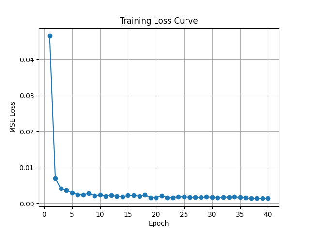
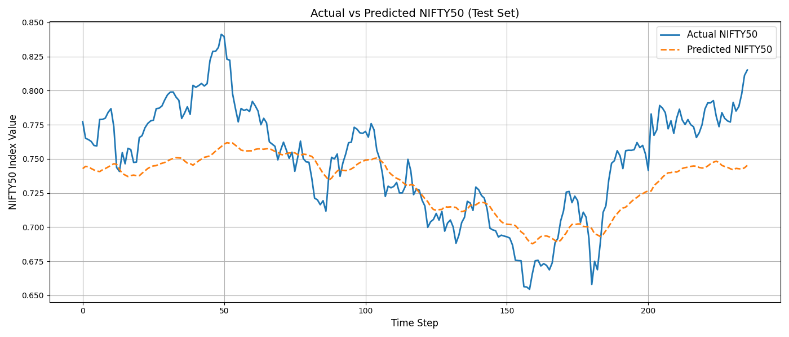
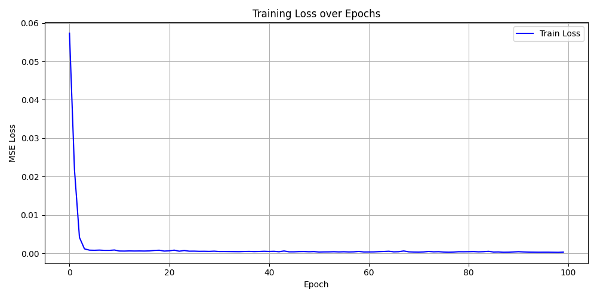
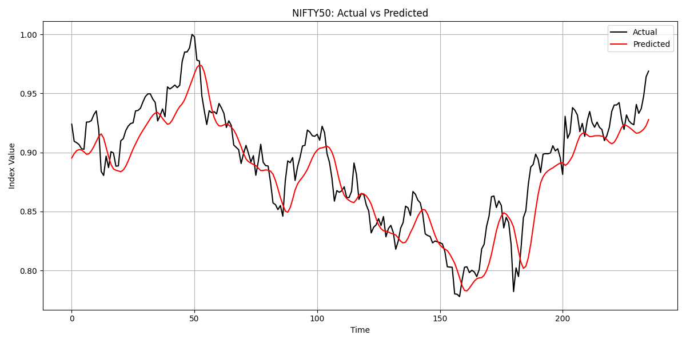

# Index-Tracking-Using-LSTM

This repository contains a PyTorch-based implementation for predicting the NIFTY50 index using historical stock data from its constituent companies. Two approaches are included:

- Multivariate LSTM: Uses multiple features (technical indicators of 20 stocks).
- Univariate LSTM: Uses only past values of NIFTY50 for prediction.

## Project Structure

INDEX TRACKING/
├── nifty50_lstm_data/ # Raw stock/index CSV files (one per company)
├── processed_data/
│ └── final_multivariate/ # Final trained multivariate model + plots
│ ├── best_lstm_model.pth
│ ├── nifty_scaler.save
│ ├── nifty50_prediction_plot.png
│ ├── nifty50_real_vs_predicted.png
│ └── training_loss_curve.png
├── data_collection.py # Collects and saves stock/index data
├── fix_nifty50_csv.py # Cleans NIFTY50 index CSV format
├── preprocessing.py # Adds technical indicators, creates train/test
├── lstm_model.py # Univariate LSTM model training script
├── multivariate_lstm.py # Final multivariate LSTM model training
├── evaluate_model.py # Evaluation script for univariate LSTM
└── evaluate_multivariate_lstm.py # Evaluation for final multivariate LSTM

---

### Input

- 100 features (20 NIFTY50 stocks × 5 technical indicators: `Adj_Close`, `MA10`, `MA30`, `RSI`, `MACD`)
- Target: NIFTY50 index value

## Project Workflow

1. **Data Collection**

   - `data_collection.py` downloads stock data for NIFTY50 companies from Yahoo Finance.
   - `fix_nifty50_csv.py` ensures the NIFTY50 index CSV matches the stock date format.

2. **Preprocessing**

   - `preprocessing.py` computes:
     - Moving Averages (MA10, MA30)
     - RSI
     - MACD
   - Creates `train.csv` and `test.csv` with all 100 features (20 stocks × 5 indicators) and `NIFTY50` as the target.

3. **Univariate Modeling (Experimental)**

   - `lstm_model.py`: Trains an LSTM on just the `NIFTY50` index to test prediction pipeline.
   - `evaluate_model.py`: Evaluates and plots univariate prediction results.

4. **Multivariate Modeling (Final Approach)**
   - `multivariate_lstm.py`: Trains an LSTM using 100 input features to predict NIFTY50.
   - `evaluate_multivariate_lstm.py`: Evaluates the multivariate model, calculates RMSE, MAE, R², and saves plots.

---

## Key Model Details

- **Model**: PyTorch LSTM
- **Input Size**:
  - 1 for univariate (`NIFTY50` only)
  - 100 for multivariate (20 stocks × 5 indicators)
- **Architecture**:
  - Hidden Size: 128
  - Layers: 3
  - Dropout: 0.3
  - Sequence Length: 30
- **Optimizer**: Adam
- **Loss Function**: MSE

---

## Visualizations

Plots are saved in the respective output folders.  
You can view them here after cloning the repo:

- Multivariate Training Loss  
  

- Multivariate Final Prediction
  

- Univariate Training Loss  
  

- Univariate Final Prediction  
  

---

## Getting Started

### Requirements

Install required packages:

```bash
pip install torch pandas numpy matplotlib scikit-learn
```

Train Multivariate LSTM

```bash
python train_multivariate_lstm.py
```

Evaluate Multivariate LSTM

```bash
python evaluate_multivariate.py
```

Train Univariate LSTM

```bash
python lstm_model.py
```

Evaluate Univariate LSTM

```bash
python evaluate_model.py
```

# Notes

- Built and tested on GPU using PyTorch.

- Code structured to allow easy switching between univariate and multivariate setups.

- Dataset spans from 2020-01-01 to 2025-06-30.

# Author

Het Sevalia
